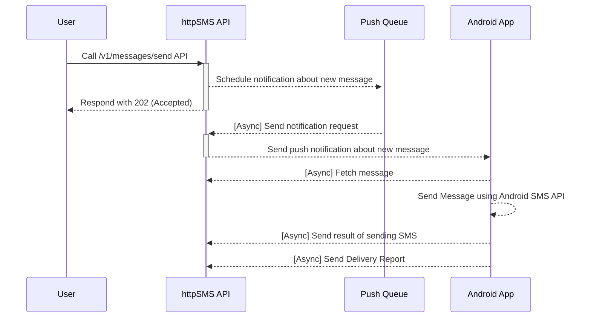

# httpSMS

[](https://github.com/NdoleStudio/httpsms/actions/workflows/ci.yml)
[](https://github.com/NdoleStudio/httpsms/graphs/contributors)
[](https://github.com/NdoleStudio/httpsms/blob/master/LICENSE)
[](CODE_OF_CONDUCT.md)
[](https://scrutinizer-ci.com/g/NdoleStudio/httpsms/?branch=main)
[](https://uptime.betterstack.com/?utm_source=status_badge)
[](https://discord.gg/kGk8HVqeEZ)

[httpSMS](https://httpsms.com) is a service that lets you use your Android phone as an SMS Gateway to send and receive SMS messages.
You make a request to a simple HTTP API and it triggers your Android phone to send an SMS. SMS messages received on your android phone can also be forwarded to your webhook endpoint.

Quick Start Guide 👉 [https://docs.httpsms.com](https://docs.httpsms.com)


## Why?

I'm originally from Cameroon and I wanted an automated way to send and receive SMS messages using an API.
Unfortunately many countries don't support the ability to buy virtual phone numbers, and I could not find a good ready-made
solution that could help me send/receive SMS messages using a mobile phone using an intuitive http API.

## Web UI

The web interface https://httpsms.com is built using [Nuxt](https://nuxtjs.org/) and [Vuetify](https://vuetifyjs.com/en/).
It is hosted as a single page application on firebase. The source code is in the [web](./web) directory

## API

The API https://api.httpsms.com is built using [Fiber](https://gofiber.io/), Go and [CockroachDB](https://www.cockroachlabs.com/) for the database.
It rus as a serverless application on Google Cloud Run. The API documentation can be found here https://api.httpsms.com/index.html

```go
// Sending an SMS Message using Go
client := htpsms.New(htpsms.WithAPIKey(/* API Key from https://httpsms.com/settings */))

client.Messages.Send(context.Background(), &httpsms.MessageSendParams{
    Content: "This is a sample text message",
    From:    "+18005550199",
    To:      "+18005550100",
})
```

## Android App

[The Android App](https://github.com/NdoleStudio/httpsms/releases/latest/download/HttpSms.apk) is a native application built using Kotlin with material design principles.
This app must be installed on an Android phone before you can start sending and receiving SMS messages.

[](https://github.com/NdoleStudio/httpsms/releases/)

## Chat/forum

There are a few ways to get in touch with me and/or the rest of the community. Feel free to use any of these methods. Whatever
works best for you:

- [Discord server](https://discord.gg/kGk8HVqeEZ) - direct chat with the community
- [GitHub issues](https://github.com/NdoleStudio/httpsms/issues) - questions, features, bugs

## Features

### End-to-end Encryption

You can encrypt your messages end-to-end ysubg the military grade [AES-256 encryption](https://en.wikipedia.org/wiki/Advanced_Encryption_Standard)
algorithm. Your encryption key is stored only on our mobile phone so the even the server won't have any way to view the
content of your SMS messages which are sent and received on your Android phone.

### Webhook

If you want to build advanced integrations, we support webhooks. The httpSMS platform can forward SMS messages received
on the android phone to your server using a callback URL which you provide.

### Back Pressure

In-order not to abuse the SMS API on android, you can set a rate limit e.g 3 messages per minute. Such that even if you
call the API to send messages to 100 people, It will only send the messages at a rate of 3 messages per minute.

### Message Expiration

Sometimes it happens that the phone doesn't get the push notification in time and I can't send the SMS message. It is
possible to set a timeout for which a message is valid and if a message becomes expired after the timeout elapses, you
will be notified.

## API Clients

- Go: https://github.com/NdoleStudio/httpsms-go
- JavaScript/TypeScript: https://github.com/NdoleStudio/httpsms-node

## Flows

### Sending an SMS Message



## License

This project is licensed under the GNU AFFERO GENERAL PUBLIC LICENSE Version 3 - see the [LICENSE](LICENSE) file for details
