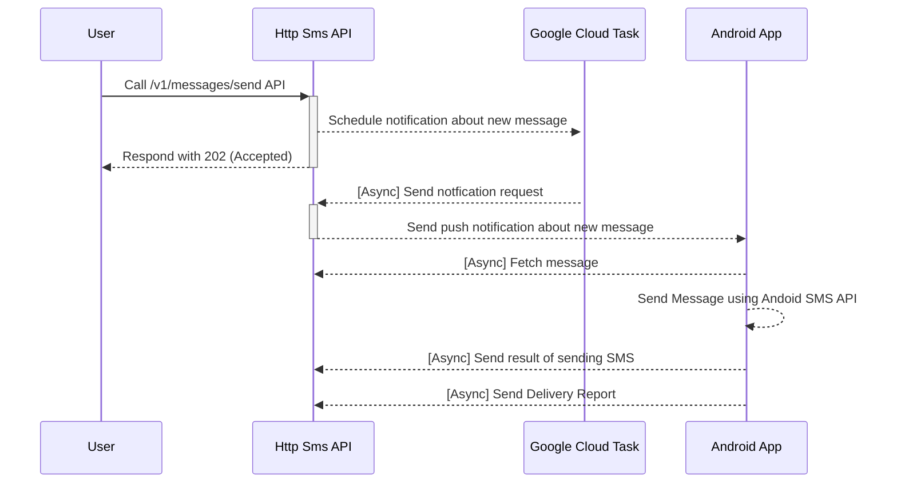

# HTTP SMS

[](https://github.com/NdoleStudio/httpsms/actions/workflows/ci.yml)
[](https://github.com/NdoleStudio/httpsms/graphs/contributors)
[](https://github.com/NdoleStudio/httpsms/blob/master/LICENSE)

[HTTP SMS](https://httpsms.com) is a service that lets you use your android phone as an SMS Gateway to send and receive SMS messages.
You make a request to the API which it triggers your android phone to send an SMS.

Quick Start Guide 👉 [https://docs.httpsms.com](https://docs.httpsms.com)


## Why?

I'm originally from Cameroon and I wanted an automated way to send and receive SMS messages using an API.
Unfortunately many countries don't support the ability to buy virtual phone numbers, and I could not find a good ready-made
solution that could help me send/receive SMS messages using a mobile phone using an intuitive http API.

## Technology

### Web

The web interface https://httpsms.com is built using [Nuxt](https://nuxtjs.org/) and [Vuetify](https://vuetifyjs.com/en/).
It is hosted as a single page application on firebase. The source code is in the [web](./web) directory

### API

The API https://api.httpsms.com is built using [Fiber](https://gofiber.io/), Go and [CockroachDB](https://www.cockroachlabs.com/) for the database.
It rus as a serverless application on Google Cloud Run. The API documentation can be found here https://api.httpsms.com/index.html

```go
// Sending an SMS Message using Go
client := htpsms.New(htpsms.WithAPIKey(/* API Key from https://httpsms.com/settings */))

client.Messages.Send(context.Background(), &httpsms.MessageSendParams{
    Content: "This is a sample text message",
    From:    "+18005550199",
    To:      "+18005550100",
})
```

### Android App

[The Android App](https://github.com/NdoleStudio/httpsms/releases/download/v0.0.1/HttpSms.apk) is a native application
built using Kotlin with material design principles. This app must be installed on an android phone before you can start
sending and receiving SMS messages.

## Features

### Webhook

If you want to build advanced integrations, we support webhooks. The httpSMS platform can forward SMS messages received
on the android phone to your server using a callback URL which you provide.

### Back Pressure

In-order not to abuse the SMS API on android, you can set a rate limit e.g 3 messages per minute. Such that even if you
call the API to send messages to 100 people, It will only send the messages at a rate of 3 messages per minute.

### Message Expiration

Sometimes it happens that the phone doesn't get the push notification in time and I can't send the SMS message. It is
possible to set a timeout for which a message is valid and if a message becomes expired after the timeout elapses, you
will be notified.

## API Clients

- Go: https://github.com/NdoleStudio/httpsms-go

## Flows

### Sending an SMS Message



## License

This project is licensed under the MIT License - see the [LICENSE](LICENSE) file for details
