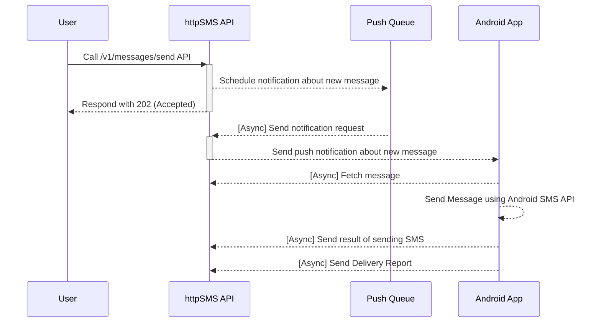

# httpSMS

[](https://github.com/NdoleStudio/httpsms/actions/workflows/ci.yml)
[](https://github.com/NdoleStudio/httpsms/graphs/contributors)
[](https://github.com/NdoleStudio/httpsms/blob/master/LICENSE)
[](CODE_OF_CONDUCT.md)
[](https://scrutinizer-ci.com/g/NdoleStudio/httpsms/?branch=main)
[](https://uptime.betterstack.com/?utm_source=status_badge)
[](https://github.com/sponsors/ndolestudio)
[](https://discord.gg/kGk8HVqeEZ)

[httpSMS](https://httpsms.com) is a service that lets you use your Android phone as an SMS Gateway to send and receive SMS messages.
You make a request to a simple HTTP API and it triggers your Android phone to send an SMS. SMS messages received on your android phone can also be forwarded to your webhook endpoint.

Quick Start Guide 👉 [https://docs.httpsms.com](https://docs.httpsms.com)


## Table Of Contents

<!-- START doctoc generated TOC please keep comment here to allow auto update -->
<!-- DON'T EDIT THIS SECTION, INSTEAD RE-RUN doctoc TO UPDATE -->

- [Why?](#why)
- [Web UI](#web-ui)
- [API](#api)
- [Android App](#android-app)
- [Chat/forum](#chatforum)
- [Features](#features)
  - [End-to-end Encryption](#end-to-end-encryption)
  - [Webhook](#webhook)
  - [Back Pressure](#back-pressure)
  - [Message Expiration](#message-expiration)
- [API Clients](#api-clients)
- [Flows](#flows)
  - [Sending an SMS Message](#sending-an-sms-message)
- [Self Host Setup - Docker](#self-host-setup---docker)
  - [1. Setup Firebase](#1-setup-firebase)
  - [2. Setup SMTP Email service](#2-setup-smtp-email-service)
  - [3. Download the code](#3-download-the-code)
  - [4. Setup the environment variables](#4-setup-the-environment-variables)
  - [5. Build and Run](#5-build-and-run)
  - [6. Create the System User](#6-create-the-system-user)
  - [7. Build the Android App.](#7-build-the-android-app)
- [License](#license)

<!-- END doctoc generated TOC please keep comment here to allow auto update -->

## Why?

I'm originally from Cameroon and I wanted an automated way to send and receive SMS messages using an API.
Unfortunately many countries don't support the ability to buy virtual phone numbers, and I could not find a good ready-made
solution that could help me send/receive SMS messages using a mobile phone using an intuitive http API.

## Web UI

The web interface https://httpsms.com is built using [Nuxt](https://nuxtjs.org/) and [Vuetify](https://vuetifyjs.com/en/).
It is hosted as a single page application on firebase. The source code is in the [web](./web) directory

## API

The API https://api.httpsms.com is built using [Fiber](https://gofiber.io/), Go and [CockroachDB](https://www.cockroachlabs.com/) for the database.
It rus as a serverless application on Google Cloud Run. The API documentation can be found here https://api.httpsms.com/index.html

```go
// Sending an SMS Message using Go
client := htpsms.New(htpsms.WithAPIKey(/* API Key from https://httpsms.com/settings */))

client.Messages.Send(context.Background(), &httpsms.MessageSendParams{
    Content: "This is a sample text message",
    From:    "+18005550199",
    To:      "+18005550100",
})
```

## Android App

[The Android App](https://apk.httpsms.com/HttpSms.apk) is a native application built using Kotlin with material design principles.
This app must be installed on an Android phone before you can start sending and receiving SMS messages.

[](https://github.com/NdoleStudio/httpsms/releases/)

## Chat/forum

There are a few ways to get in touch with me and/or the rest of the community. Feel free to use any of these methods. Whatever
works best for you:

- [Discord server](https://discord.gg/kGk8HVqeEZ) - direct chat with the community
- [GitHub issues](https://github.com/NdoleStudio/httpsms/issues) - questions, features, bugs

## Features

### End-to-end Encryption

You can encrypt your messages end-to-end ysubg the military grade [AES-256 encryption](https://en.wikipedia.org/wiki/Advanced_Encryption_Standard)
algorithm. Your encryption key is stored only on our mobile phone so the even the server won't have any way to view the
content of your SMS messages which are sent and received on your Android phone.

### Webhook

If you want to build advanced integrations, we support webhooks. The httpSMS platform can forward SMS messages received
on the android phone to your server using a callback URL which you provide.

### Back Pressure

In-order not to abuse the SMS API on android, you can set a rate limit e.g 3 messages per minute. Such that even if you
call the API to send messages to 100 people, It will only send the messages at a rate of 3 messages per minute.

### Message Expiration

Sometimes it happens that the phone doesn't get the push notification in time and I can't send the SMS message. It is
possible to set a timeout for which a message is valid and if a message becomes expired after the timeout elapses, you
will be notified.

## API Clients

- [x] Go: https://github.com/NdoleStudio/httpsms-go
- [x] JavaScript/TypeScript: https://github.com/NdoleStudio/httpsms-node

## Flows

### Sending an SMS Message



## Self Host Setup - Docker

### 1. Setup Firebase

- The httpSMS application uses [firebase cloud messaging](https://firebase.google.com/docs/cloud-messaging) for sending push notifications to your Android phone to trigger an SMS message to be sent out.
  Visit the [firebase console](https://console.firebase.google.com/) and create a new project and follow the [steps here](https://firebase.google.com/docs/web/setup#register-app) to get your firebase web SDK config credentials.
  For example, I created a firebase project called `httpsms-docker` and this is my web SDK configuration

```js
const firebaseConfig = {
  apiKey: "AIzaSyAKqPvj51igvvNNcRtxxxxx",
  authDomain: "httpsms-docker.firebaseapp.com",
  projectId: "httpsms-docker",
  storageBucket: "httpsms-docker.appspot.com",
  messagingSenderId: "668063041624",
  appId: "1:668063041624:web:29b9e3b702796xxxx",
  measurementId: "G-18VRYL2xxxx",
};
```

- Enable `Email/Password` sign-in in the [Firebase console](https://console.firebase.google.com/u/0/), open the **Authentication** section. On the Sign in method tab, enable the `Email/password` sign-in method and click `Save`.
  - The firebase `email/password` sign-in method has [a bug](https://github.com/firebase/firebaseui-web/issues/1040) which prevents you from signing in. The work around right now is to [disable email enumeration protection](https://cloud.google.com/identity-platform/docs/admin/email-enumeration-protection#disable) on the firebase console.
- Generate your firebase service account credentials by following the [steps here](https://firebase.google.com/docs/admin/setup#initialize_the_sdk_in_non-google_environments) and save the credentials in a file called `firebase-credentials.json` we will use this file to authenticate with the firebase admin SDK.
- Generate your Android `google-services.json` file using [the instructions here](https://support.google.com/firebase/answer/7015592?hl=en#android&zippy=%2Cin-this-article) we will use it letter to configure the android app.

### 2. Setup SMTP Email service

The httpSMS application uses [SMTP](https://en.wikipedia.org/wiki/Simple_Mail_Transfer_Protocol) to send emails to users e.g. when your Android phone has been offline for a long period of time.
You can use a service like [mailtrap](https://mailtrap.io/) to create an SMTP server for development purposes.

### 3. Download the code

Clone the httpSMS GitHub repository

```bash
git clone https://github.com/NdoleStudio/httpsms.git
```

### 4. Setup the environment variables

- Copy the `.env.docker` file in the `web` directory into `.env`

```bash
cp web/.env.docker web/.env
```

- Update the environment variables in the `.env` file in the `web` directory with your firebase web SDK configuration in step 1 above

```dotenv
FIREBASE_API_KEY=
FIREBASE_AUTH_DOMAIN=
FIREBASE_PROJECT_ID=
FIREBASE_STORAGE_BUCKET=
FIREBASE_MESSAGING_SENDER_ID=
FIREBASE_APP_ID=
FIREBASE_MEASUREMENT_ID=
```

- Copy the `.env.docker` file in the `api` directory into `.env`

```bash
cp api/.env.docker api/.env
```

- Update the environment variables in the `.env` file in the `api` directory with your firebase service account credentials and SMTP server details.

```dotenv
# SMTP email server settings
SMTP_USERNAME=
SMTP_PASSWORD=
SMTP_HOST=
SMTP_PORT=

# Firebase service account credentials
FIREBASE_CREDENTIALS=

# This is the `projectId` from your firebase web config
GCP_PROJECT_ID=
```

- Don't bother about the `EVENTS_QUEUE_USER_API_KEY` and `EVENTS_QUEUE_USER_ID` settings. We will set that up later.

### 5. Build and Run

- Build and run the API, the web UI, database and cache using the `docker-compose.yml` file. It takes a while for build and download all the docker images.
  When it's finished, you'll be able to access the web UI at http://localhost:3000 and the API at http://localhost:8000

```bash
docker compose up --build
```

### 6. Create the System User

- The application uses the concept of a system user to process events async. You should manually create this user in `users` table in your database.
  Make sure you use the same `id` and `api_key` as the `EVENTS_QUEUE_USER_ID`, and `EVENTS_QUEUE_USER_API_KEY` in your `.env` file

### 7. Build the Android App.

- Before building the Android app in [Android Studio](https://developer.android.com/studio), you need to replace the `google-services.json` file in the `android/app` directory with the file which you got from step 1. You need to do this for the firebase FCM messages to work properly.

## License

This project is licensed under the GNU AFFERO GENERAL PUBLIC LICENSE Version 3 - see the [LICENSE](LICENSE) file for details
