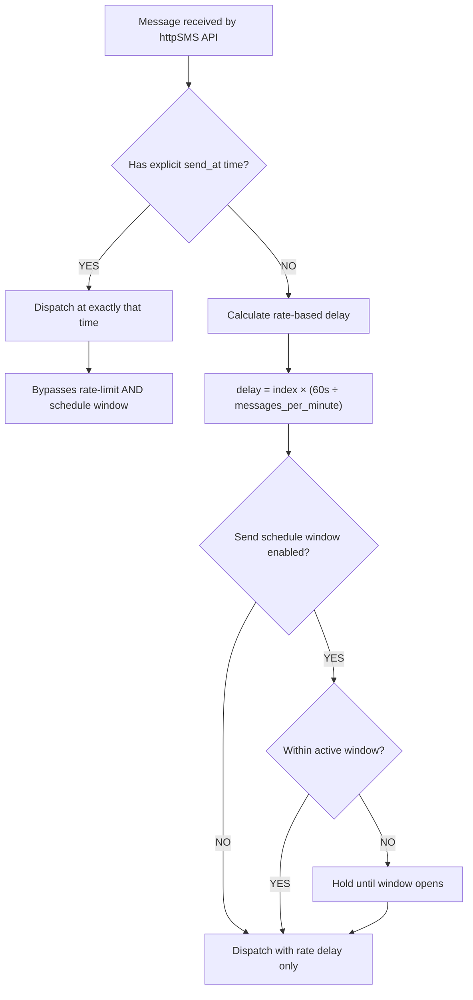

# Outgoing Message Queue

Complete guide on how httpSMS queues outgoing SMS messages for reliable delivery, including rate-based dispatch, scheduled sending, and send schedule windows.

## How the Message Queue Works

When you send an SMS through httpSMS (via the API, bulk send, or Excel upload), messages don't go directly to your Android phone. Instead, they enter an **outgoing message queue** that intelligently schedules delivery to ensure reliability and prevent carrier throttling.

The queue determines **when** each message is dispatched to your phone based on three factors:

1. **Explicit send time** — If you specify a `send_at` time, the message is sent at exactly that time
2. **Rate-based dispatch delay** — Messages without a send time are spaced out based on your configured send rate
3. **Send schedule window** — Messages can be held until your configured active hours (if enabled)

## 1. Explicit Send Time (Bypass Queue Logic)

When you specify a `send_at` time in your API request or a `SendTime` column in your Excel upload, the message **bypasses** both rate-limiting and schedule window logic entirely. The message will be dispatched to your phone at exactly the time you specified.

This is ideal for:

- Time-sensitive alerts that must go out at a precise moment
- Promotional messages timed for a specific campaign window
- Appointment reminders scheduled for a specific time before the appointment

### Sending a single message at a specific time

```bash
curl -L \
  --request POST \
  --url 'https://api.httpsms.com/v1/messages/send' \
  --header 'Content-Type: application/json' \
  --header 'x-api-Key: YOUR_API_KEY' \
  --data '{
    "from": "+18005550199",
    "to": "+18005550100",
    "content": "Your appointment is in 1 hour",
    "send_at": "2025-12-19T16:39:57-08:00"
  }'
```

The `send_at` field accepts time in [RFC 3339 format](https://datatracker.ietf.org/doc/html/rfc3339) which includes the time zone (e.g., `1996-12-19T16:39:57-08:00`). You can schedule messages up to 20 days (480 hours) in the future.

> **Note:** If you specify a `send_at` time that is in the past, the message will be sent immediately.

### Setting send time in bulk Excel uploads

When using the [bulk messages Excel template](https://httpsms.com/templates/httpsms-bulk.xlsx), you can set the optional `SendTime(optional)` column to specify when each message should be sent. Use the format `YYYY-MM-DDTHH:MM:SS` in your local time zone (e.g., `2023-11-13T02:10:01`).

Each row with a `SendTime` value will be dispatched at exactly that time, independent of other messages in the batch.

## 2. Rate-Based Dispatch Delay

When you send messages **without** a `send_at` time (especially in bulk), httpSMS automatically spaces out delivery based on your phone's configured **Messages Per Minute** rate. This prevents carrier throttling and ensures reliable delivery.

### How rate-based dispatch works

The system calculates a dispatch delay for each message based on its position in the batch:

```
interval = 60 seconds ÷ messages_per_minute
delay    = message_index × interval
```

**Example:** If your phone is configured for 10 messages per minute:

| Message | Index | Delay | Dispatched At |
| ------- | ----- | ----- | ------------- |
| 1st     | 0     | 0s    | Immediately   |
| 2nd     | 1     | 6s    | +6 seconds    |
| 3rd     | 2     | 12s   | +12 seconds   |
| 4th     | 3     | 18s   | +18 seconds   |
| 10th    | 9     | 54s   | +54 seconds   |

This ensures your phone sends at most 10 SMS per minute, matching the configured rate.

### Per-phone indexing for bulk sends

When sending bulk messages to multiple recipients from the same phone number, the index is calculated per phone. This means messages to different recipient numbers are all spaced according to the sending phone's rate, ensuring the sending phone isn't overwhelmed.

When using Excel/CSV uploads with multiple sender phones (different `From` numbers), each phone gets its own independent index counter. Messages from Phone A don't affect the timing of messages from Phone B.

### Configuring Messages Per Minute

To modify the send rate for your phone number:

1. Go to [https://httpsms.com/settings](https://httpsms.com/settings#phones)
2. Tap the **"EDIT"** button on the phone number
3. Update the **"Messages Per Minute"** value

**Default:** 10 messages per minute for newly registered phones.

**Maximum:** 29 messages per minute (the [maximum permitted by an unrooted Android phone](https://android.googlesource.com/platform/frameworks/opt/telephony/+/master/src/java/com/android/internal/telephony/SmsUsageMonitor.java#84)).

> **Tip:** If you're sending large batches, a lower rate (5-10/min) is more reliable. Higher rates (20+/min) may trigger carrier spam filters depending on your region.

## 3. Send Schedule Window

The send schedule window allows you to restrict message delivery to specific hours of the day. When enabled, messages sent outside the configured window are held in the queue and dispatched when the next window opens.

This is useful for:

- Respecting recipient quiet hours (no messages at 3 AM)
- Complying with regional messaging regulations
- Concentrating delivery during business hours

> **Important:** Messages with an explicit `send_at` time bypass the send schedule window entirely. Only messages without a specified send time are subject to window restrictions.

### Configuring the Send Schedule

You can configure the send schedule window for each phone number in your account settings at [https://httpsms.com/settings](https://httpsms.com/settings#phones). Click **"EDIT"** on the phone number and set:

- **Schedule Active** — Enable or disable the schedule window
- **Start Time** — The time of day when sending begins (e.g., `08:00`)
- **End Time** — The time of day when sending stops (e.g., `21:00`)
- **Timezone** — The timezone for the schedule (e.g., `America/New_York`)

### How the schedule window works

| Current Time vs Window | Behavior                                               |
| ---------------------- | ------------------------------------------------------ |
| Within window          | Message dispatched immediately (subject to rate delay) |
| Before window opens    | Message held until window start time                   |
| After window closes    | Message held until next day's window start time        |

## Bulk Send via API

When sending to multiple recipients using the bulk API endpoint, all messages are automatically queued with rate-based dispatch delays:

```bash
curl -L \
  --request POST \
  --url 'https://api.httpsms.com/v1/messages/bulk-send' \
  --header 'Content-Type: application/json' \
  --header 'x-api-Key: YOUR_API_KEY' \
  --data '{
    "from": "+18005550199",
    "to": ["+18005550100", "+18005550101", "+18005550102"],
    "content": "Hello from httpSMS!"
  }'
```

In this example, with a default rate of 10 messages/minute:

- Message to `+18005550100` → sent immediately
- Message to `+18005550101` → sent after 6 seconds
- Message to `+18005550102` → sent after 12 seconds

## Summary: Queue Decision Flow



## Key Points

- **Explicit send time always wins** — Setting `send_at` bypasses all queue logic
- **Rate limiting prevents throttling** — Messages are spaced based on your configured rate
- **Schedule windows respect quiet hours** — Messages without a send time are held until the window opens
- **Per-phone independence** — Each sending phone has its own rate counter and schedule
- **Past send times are handled gracefully** — If `send_at` is in the past, the message sends immediately
